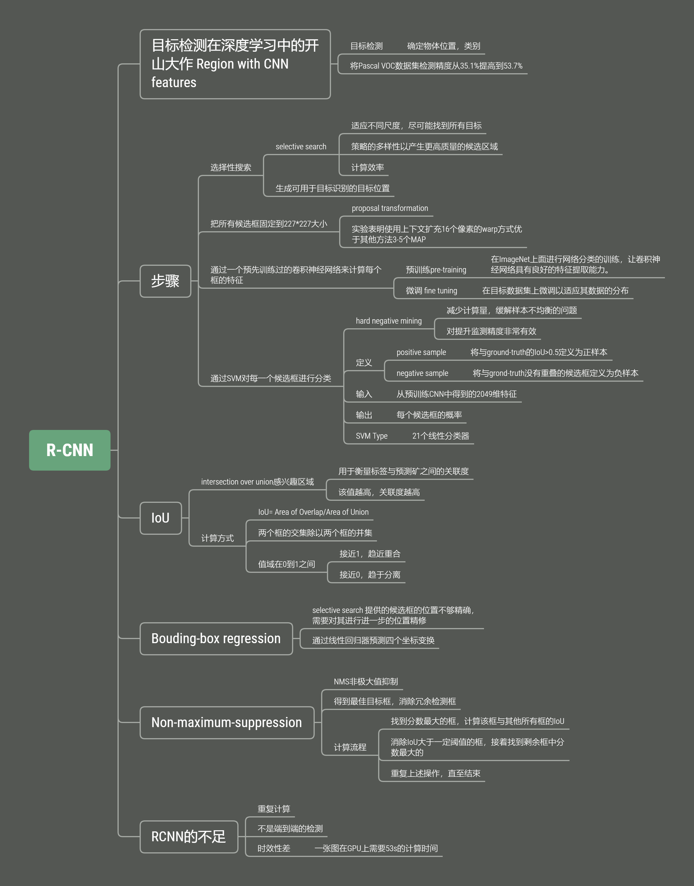
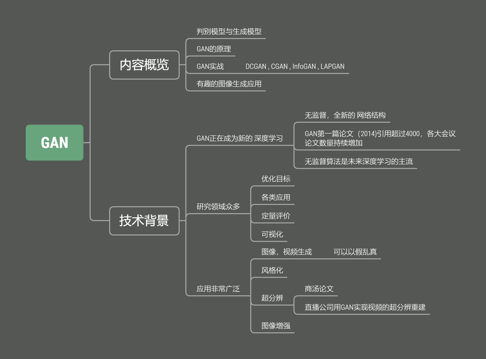
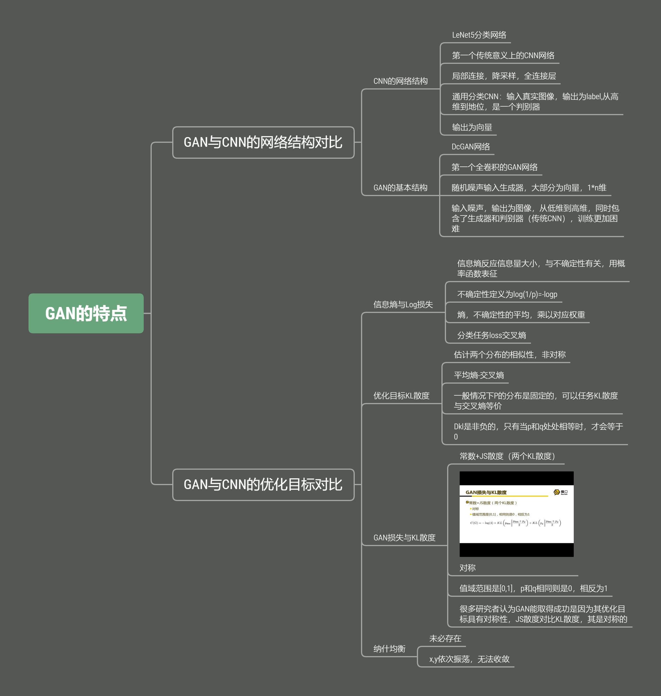
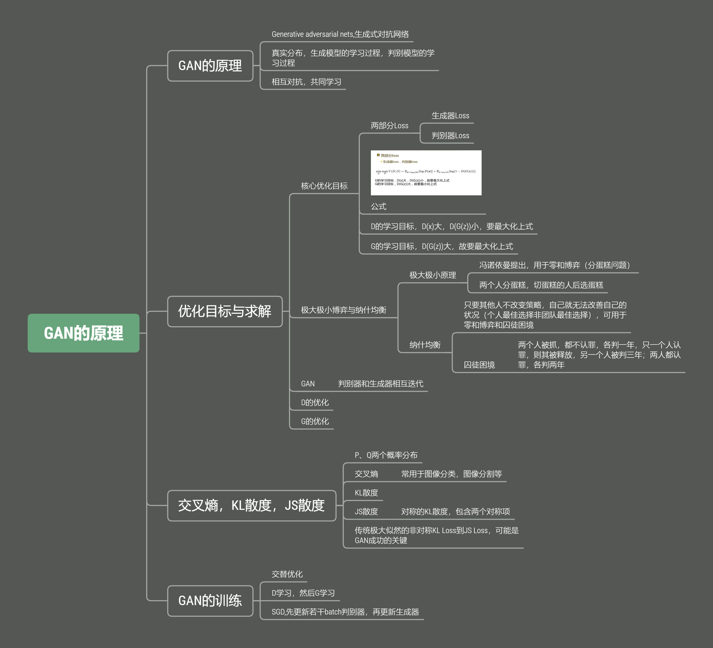
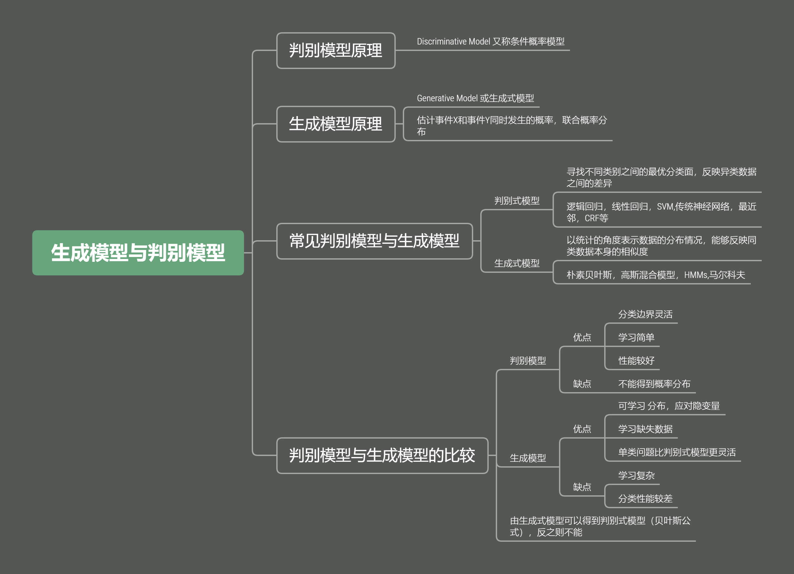

# Deep-Learning-Paper-Notes
Deep learning paper study notes(mind mapping)，including R-CNN,Fast R-CNN and Faster R-CNN,Mask-RCNN,GAN,BERT,etc.
## R-CNN

## Fast RCNN and Faster RCNN

## GAN

## GAN的特点

## GAN的原理

## 生成模型与判别模型

